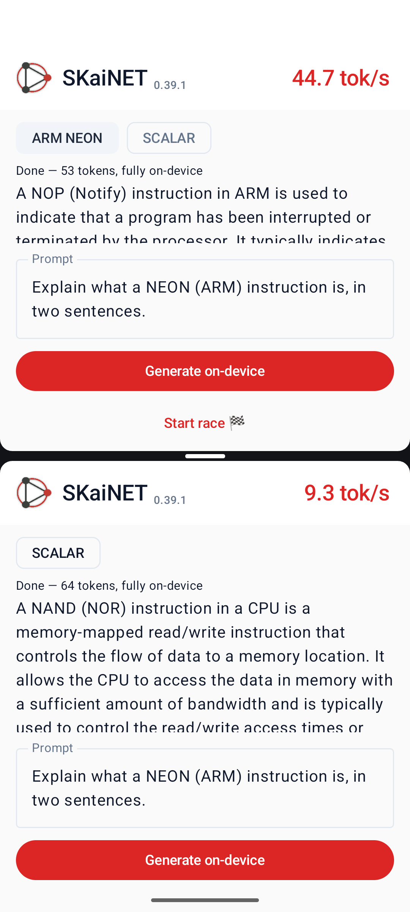

# AndroidNeonLlmDemo

On-device LLM chat on Android, accelerated by SKaiNET's hand-written ARM NEON
kernels — with a built-in **NEON vs scalar** comparison so you can measure the
difference on your own phone.

SmolLM2-135M (Q8_0 GGUF) decodes fully on-device through
`skainet-backend-jni-cpu`: hand-written NEON matmul kernels behind a JNI
bridge, with two `.so` tiers (`armv8-a` and `armv8.2-a+fp16+dotprod`) selected
at runtime per device.

## What it demonstrates

- **~5-line integration**: `DecoderGgufWeightLoader` → `OptimizedLLMRuntime` →
  `generateUntilStop`, streaming tokens into Compose (see `LlmEngine.kt`).
- **NEON | SCALAR switch**: two chips re-pin the kernel registry (engine
  reloads on the next run) — same APK, same model, full-device A/B with a live
  tok/s counter. After every generation the kernel time breakdown is logged
  under the `SKAINET_DEMO` tag.
- **Split-screen race**: one button launches a second process with the scalar
  provider pinned and starts both generations simultaneously.

  
- **Model delivery**: downloads the GGUF from the Hugging Face Hub on first
  run (SKaiNET's Ktor fetcher, streamed to disk with progress). To go fully
  offline instead, place `SmolLM2-135M-Instruct-Q8_0.gguf` in
  `app/src/main/assets/` before building.
- **SKaiNET design system** from the shared [`../skainet-ui`](../skainet-ui)
  module (theme, logo, `FadingRingLoader`).

## Run

Real ARM64 hardware shows the point best (an x86 emulator falls back to scalar):

```sh
./gradlew :app:installDebug
```

Tap **Generate on-device** — the model (~145 MB) downloads on first use. Then
flip the **SCALAR** chip and generate again to see the difference, or tap
**Race against scalar** for the side-by-side version.

Reference numbers (SmolLM2-135M Q8_0, SKaiNET 0.39.1): ~6.4× decode-kernel
throughput NEON vs scalar on a Pixel 8a; generation is matmul-bound since
0.39.1's eager-op fast paths.

## Requirements

- ARM64 Android device (minSdk 24, one APK covers armv8.0 through armv9)
- JDK 17+ for the build; no NDK needed (kernels ship inside the AAR)
