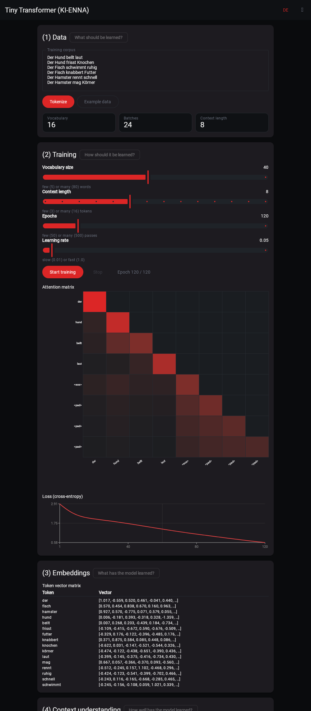

# SKaiNET Examples

Sample applications built with [**SKaiNET**](https://github.com/SKaiNET-developers/SKaiNET) —
the Kotlin Multiplatform AI framework. Each example is a self-contained project;
most are Compose Multiplatform apps that run on Android, iOS, Desktop and the web
from a single Kotlin codebase.

> [!IMPORTANT]
> **About the name**
>
> “SKaiNET” is a **working project name** chosen early in the project’s life as part of a personal learning and experimentation effort, before any trademark considerations were known.
>
> The name is **not intended to reference, infringe, or imply association with any existing trademarks, companies, or products**. It is not a commercial brand and is **not claimed or assignable** to any company or organization that contributors may be affiliated with.
>
> If a naming conflict arises, the project name may be changed in the future.

## Examples

### 🌊 Sinus Approximator

A tiny neural network that learns to approximate `sin(x)` — and you can **train it
live in the app**. Visualises the target curve, the model's prediction, and the
network architecture. One Kotlin codebase running on Android, iOS, Desktop (JVM)
and WebAssembly.


📂 [`SinusApproximator/`](SinusApproximator/) · runs on Android · iOS · Desktop · Wasm

---

### ✏️ MNIST Demo

Handwritten-digit recognition: draw a digit and a convolutional network classifies
it on the spot. A clean-architecture Compose Multiplatform app that loads a
pretrained GGUF model and can also retrain it in-app.


📂 [`MNISTDemo/`](MNISTDemo/) · runs on Android · iOS · Desktop · Wasm

---

### 🔤 GloVe Embeddings

Word-vector arithmetic and nearest-neighbour search over pretrained GloVe
embeddings — `king - man + woman ≈ queen`, fully offline. A Compose Multiplatform
app that shows how SKaiNET handles plain vector data, not just neural nets.

📂 [`GloVeEmbeddings/`](GloVeEmbeddings/) · runs on Android · iOS · Desktop · Wasm

---

### 🤏 Tiny Transformer (KI-ENNA)

Train a **tiny decoder-only transformer live in the browser** — word-level
tokenizer, token + positional embeddings, single-head causal self-attention and
next-word prediction, with a live attention heatmap and loss curve. A SKaiNET
port of the German educational page
[KI-ENNA](https://statistical-thinking.de/ki-enna-transformer.html), built from
scratch with the core NN DSL (no transformers library), with an English/German
language toggle.



📂 [`TinyTransformer/`](TinyTransformer/) · runs on Android · iOS · Desktop · Wasm

---

### 🏁 Kernel Race

On-device LLM chat accelerated by SKaiNET's hand-written ARM NEON kernels on Android, with a
built-in **NEON vs scalar** A/B comparison — including a one-phone split-screen race. The same
Kotlin codebase also runs on Desktop and in the browser, showing the other kernel tiers SKaiNET
falls back to without NEON hardware.


📂 [`KernelRace/`](KernelRace/) · runs on Android · Desktop · Wasm

---

### 💬 Kllama Demo

A Qwen3 LLM **playground in the browser** — chat, completion, translation, tool
calls, a tokenizer view and a transformer explainer that visualises attention and
residuals, all running on-device with no server and no API key.

📂 [`KllamaDemo/`](KllamaDemo/) · runs on Android · iOS · Desktop · Web · Server

---

### ☕ MNIST Java Demo

The same MNIST digit detector as a **pure-Java CLI** — proof of SKaiNET's
first-class Java interop from a Kotlin Multiplatform engine.

```text
Predicted digit: 7
Confidence: 98.3%
```

📂 [`MnistJavaDemo/`](MnistJavaDemo/) · command-line · Java 21+

## New here?

If this is your first SKaiNET example, start with **Sinus Approximator** — it is
the smallest end-to-end story (define a network, train it, see it predict) and
runs on every platform. Then try **MNIST Demo** for a real convolutional model,
**GloVe Embeddings** for vector arithmetic, and **Kllama Demo** to run a local LLM.

Each example folder has its own `README.md` with build and run instructions.
